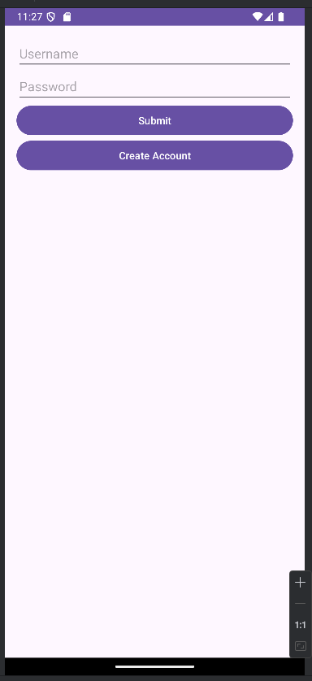
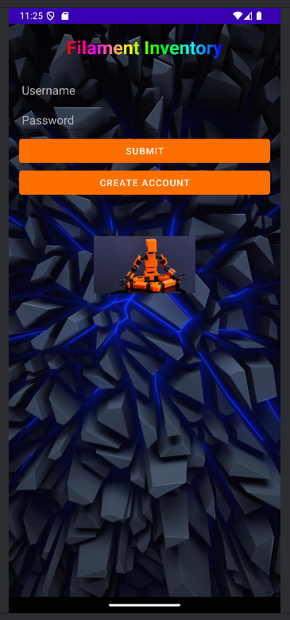
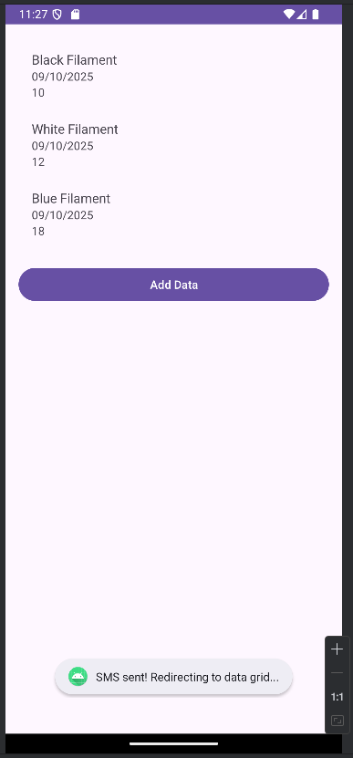
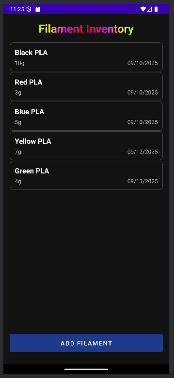
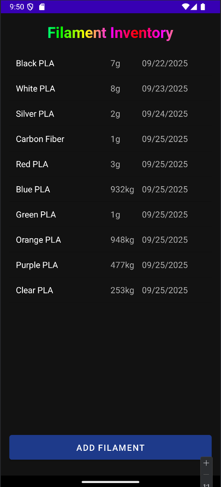
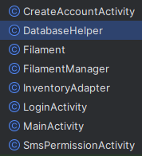

# CS 360 Inventory Management App – 3D Printing Filament

**Author:** Timothy Johnson  
**Course:** CS 499  
**Date:** September 2025  

## Overview
This Android app is an **Inventory Management tool** designed to help users track 3D printing filament spools. It was originally created as a class project and later enhanced for professional-quality usability, functionality, and design.  

The app allows users to efficiently manage filament inventory, track details such as color, quantity, and date added, and perform actions securely and reliably. Enhancements focused on UI improvements, data management, algorithms, and database integration.

## Features
- **Add, Edit, Delete, and View Filaments**  
  Each filament includes details such as color, quantity, and date added.

- **User-Friendly UI**  
  - Switched from a grid layout to a list layout for better readability  
  - Custom icons for filament spools  
  - Rainbow-colored title for visual appeal  
  - Dark theme with adjusted font sizes, spacing, and alignment  

- **Data Management**  
  - Full CRUD operations with **SQLite**  
  - Input validation to prevent invalid entries  
  - User feedback messages for success or failure  

- **Algorithms & Data Structures**  
  - FilamentManager class with a **HashMap** for fast lookups  
  - Sorting filaments by color, weight, or type  

- **Database Enhancements**  
  - SQLite integration for storing spools, colors, and storage locations  
  - Export inventory to CSV or JSON  
  - Basic password protection for admin actions  

## Screenshots
  
*Old login screen*  

  
*Enhanced login screen*  

  
*Original inventory view*  

  
*Updated inventory view with list layout*  

  
*Database in effect*  

  
*Classes after Enhancements*  

## Technical Details
- **Language:** Java  
- **IDE:** Android Studio  
- **Database:** SQLite  
- **Design Principles:** User-centered design, clean UI, modular code  
- **Data Structures:** HashMap for fast access, ArrayList for sorted display  
- **Algorithms:** Sorting by multiple properties, efficient CRUD operations  

## Learning Outcomes & Skills Demonstrated
- **Outcome 2:** Professional-quality communications through documentation, UI design, and portfolio presentation.  
- **Outcome 3:** Designing and evaluating computing solutions using object-oriented programming, data structures, and algorithms.  
- **Outcome 4:** Using innovative techniques such as custom UI elements, themes, and efficient code organization.  
- **Outcome 5:** Implementing initial security measures and input validation for safe data management.  
